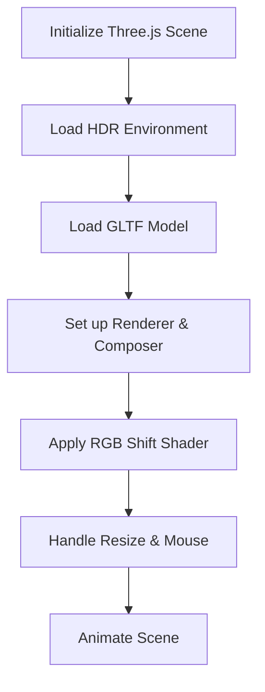
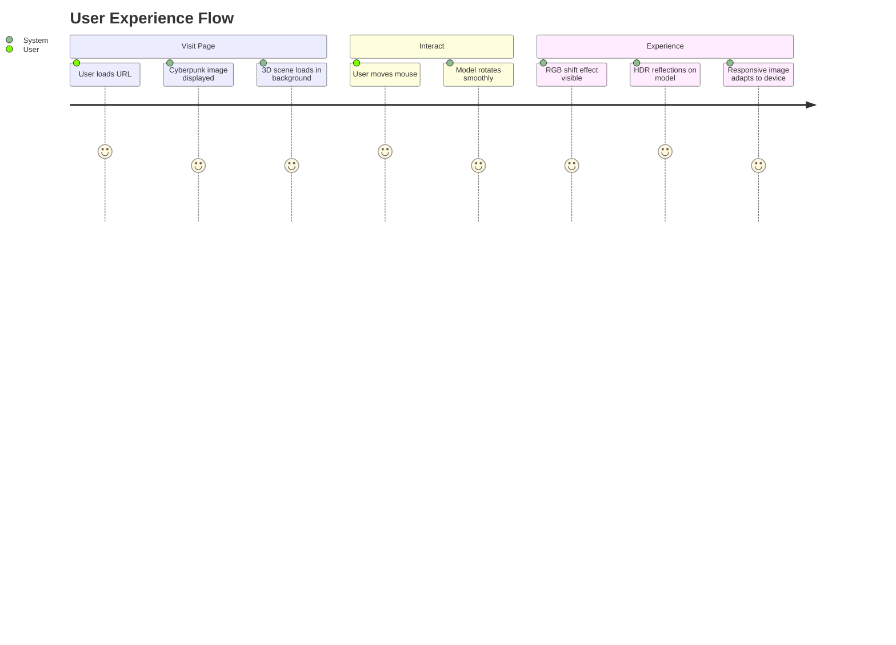
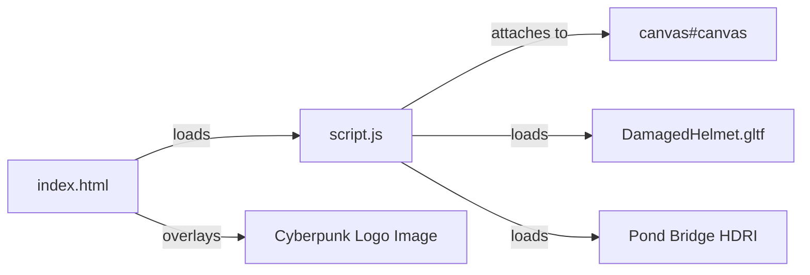

# Cyberpunk 3D Scene with Three.js 🕶️

This project delivers a visually rich, interactive cyberpunk-themed 3D experience using [Three.js](https://threejs.org/) and modern web technologies. The live demo is available at:  
**[https://cyberpunk-three-js-six.vercel.app/](https://cyberpunk-three-js-six.vercel.app/)**

---

## Project Overview

This web application displays a 3D model—specifically the **DamagedHelmet**. It overlays a cyberpunk-style image, leverages advanced post-processing effects, and supports real-time model rotation based on mouse movement. The project demonstrates integration of GLTF 3D models, HDR environment lighting, and custom shaders for visual enhancements.

---

## Main Features

- **Three.js rendering:** Real-time 3D graphics in the browser.
- **HDR environment lighting:** Realistic reflections and lighting using an HDRI map.
- **GLTF model loading:** Loads and displays the "DamagedHelmet" 3D model.
- **Custom RGB Shift Shader:** Applies a chromatic aberration/glitch effect.
- **GSAP Animations:** Smooth, animated rotation of the model based on mouse position.
- **Responsive Design:** Adapts layout and image size for mobile and desktop.
- **Cyberpunk overlay:** A striking cyberpunk logo image enhances the visual style.

---

## index.html

Defines the structure, layout, and includes all necessary scripts and styles.

### HTML Structure

- **.main**
  - **.maincontent**
    - **img:** Cyberpunk logo overlay (absolutely positioned).
    - **canvas#canvas:** The Three.js renderer attaches here.

### Key Points

- **Responsive & Mobile Friendly:**  
  Uses media queries to adjust the cyberpunk image size/position on various devices.

- **Cyberpunk Aesthetic:**  
  The page background is dark, with a striking neon image and 3D content.

### Linked Scripts

- **Three.js Core & Examples:**  
  Loads Three.js and related loaders/post-processing scripts from CDN.
- **GSAP:**  
  For smooth model animations.
- **script.js:**  
  The main application logic.

### Example HTML Snippet

```html

<canvas id="canvas"></canvas>
```

---

### CSS Styling Highlights

- **Full-Viewport Layout:**  
  `.maincontent` and `.contentarea` fill the viewport.
- **Cyberpunk Image:**  
  Absolutely positioned and responsive.
- **Custom Font:**  
  Labels use "Helvetica Now Display" (if available).

#### Responsive Image Sizing

```css
@media (max-width: 768px) {
  .maincontent img {
    width: 85vw;
    max-height: 50vh;
    top: 45%;
  }
}
```

---

## script.js

This is the heart of the application, handling Three.js setup, model loading, environment mapping, shaders, user interaction, and animation.

### Architectural Overview



---

### Main Components and Flow

#### 1. Scene and Camera Initialization

- **Scene:**  
  Creates a new `THREE.Scene()`.
- **Camera:**  
  Positioned at z=3.5; field of view is 40°.

#### 2. Renderer and Canvas

- **Renderer:**  
  Renders to the `<canvas id="canvas">`, with antialiasing and alpha enabled.
- **Pixel Ratio:**  
  Set to device pixel ratio, capped at 2 for performance.

#### 3. Post-processing with EffectComposer

- **EffectComposer:**  
  Enables advanced post-processing effects.
- **RenderPass:**  
  Renders the scene normally.
- **ShaderPass (RGB Shift):**  
  Adds a chromatic aberration effect.

#### 4. RGBShiftShader

A custom shader for a cyberpunk-style RGB split effect (glitch/artifacts).

```js
const RGBShiftShader = {
  uniforms: { ... },
  vertexShader: `...`,
  fragmentShader: `...`
};
```

**Effect:**  
Red, green, and blue channels are slightly shifted for a digital glitch appearance.

#### 5. HDR Environment Setup

- **RGBELoader:**  
  Loads an HDRI texture (`pond_bridge_night_1k.hdr`) for realistic lighting/reflections.
- **PMREMGenerator:**  
  Prepares the environment map for physically-based rendering.

#### 6. GLTF Model Loading

- **GLTFLoader:**  
  Loads the `"DamagedHelmet.gltf"` model into the scene.

#### 7. Responsive Resizing

- **onWindowResize:**  
  Adjusts camera and renderer when the window size changes.

#### 8. Mouse Interaction with GSAP

- **mousemove:**  
  Rotates the 3D model smoothly (using GSAP) based on mouse position.

```js
window.addEventListener("mousemove", (e) => {
  // Calculates rotation from mouse position
  gsap.to(model.rotation, { x: ..., y: ..., duration: 0.5, ease: "power2.out" });
});
```

#### 9. Animation Loop

- **animate():**  
  Uses `requestAnimationFrame` and the composer to render the scene and post-processing effects.

---

### Key Code Snippets

#### Scene and Renderer Setup

```js
const scene = new THREE.Scene();
const camera = new THREE.PerspectiveCamera(40, window.innerWidth / window.innerHeight, 0.1, 100);
camera.position.z = 3.5;

const renderer = new THREE.WebGLRenderer({ canvas: canvas, antialias: true, alpha: true });
renderer.setPixelRatio(Math.min(window.devicePixelRatio, 2));
renderer.setSize(window.innerWidth, window.innerHeight);
renderer.toneMapping = THREE.ACESFilmicToneMapping;
renderer.toneMappingExposure = 0.6;
renderer.outputEncoding = THREE.sRGBEncoding;
renderer.setClearColor("black");
```

#### Loading Environment and Model

```js
new THREE.RGBELoader()
  .load('https://dl.polyhaven.org/file/ph-assets/HDRIs/hdr/1k/pond_bridge_night_1k.hdr', function (texture) {
    const envMap = pmremGenerator.fromEquirectangular(texture).texture;
    scene.environment = envMap;
    texture.dispose();
    pmremGenerator.dispose();

    new THREE.GLTFLoader().load(
      'DamagedHelmet.gltf',
      (gltf) => { model = gltf.scene; scene.add(gltf.scene); }
    );
  });
```

#### Mouse-Driven Model Rotation

```js
window.addEventListener("mousemove", (e) => {
  if (model) {
    const rotationX = (e.clientX / window.innerWidth - 0.5) * (Math.PI * 0.3);
    const rotationY = (e.clientY / window.innerHeight - 0.5) * (Math.PI * 0.3);
    gsap.to(model.rotation, { x: rotationY, y: rotationX, duration: 0.5, ease: "power2.out" });
  }
});
```

#### Animation Loop

```js
function animate() {
  requestAnimationFrame(animate);
  composer.render();
}
animate();
```

---

## User Experience Flow



---

## Best Practices & Recommendations

```card
{
  "title": "Model Hosting",
  "content": "Make sure 'DamagedHelmet.gltf' is available in the public folder for the model to load correctly."
}
```

```card
{
  "title": "Performance Tuning",
  "content": "Limit post-processing effects on mobile for best performance and battery life."
}
```

---

## Key Takeaways

- **Three.js** provides a powerful way to render real-time 3D scenes in the browser.
- **Post-processing** with custom shaders like RGBShift adds a unique cyberpunk look.
- **GLTF** is a modern, efficient 3D model format for web delivery.
- **User interaction** using GSAP creates engaging, smooth animations.
- **Responsive design** ensures a great experience on all devices.

---

## Project URL

**Live Demo:**  
[https://cyberpunk-three-js-six.vercel.app/](https://cyberpunk-three-js-six.vercel.app/)

---

## File Relationship Diagram



---

## FAQ

- **Q:** What if the 3D model doesn't appear?  
  **A:** Ensure `DamagedHelmet.gltf` is in the root/public directory.

- **Q:** Can I use a different model?  
  **A:** Yes, change the file in the loader URL.

- **Q:** How can I tweak the effects?  
  **A:** Adjust shader parameters and GSAP animation in `script.js`.

---

## Summary Table

| Feature                     | Technology         | Purpose                                         |
|-----------------------------|--------------------|-------------------------------------------------|
| 3D Rendering                | Three.js           | Real-time model visualization                   |
| Model Format                | GLTF               | Efficient 3D asset delivery                     |
| Animations                  | GSAP               | Smooth mouse-driven model rotation              |
| Environment Lighting        | RGBELoader, HDRI   | Realistic reflections and lighting              |
| Post-processing             | EffectComposer     | Visual effects (RGB shift)                      |
| Responsive Image Overlay    | CSS Media Queries  | Maintains cyberpunk aesthetic on all devices    |
| User Interaction            | Mouse events       | Engaging, interactive experience                |

---

## Final Notes

This project is a solid example of combining cutting-edge web 3D, animation, and style for a memorable interactive experience.  
For further customization, explore different models, shaders, and HDRIs to make it your own!

---

**Explore more on the live site:**  
🌐 [https://cyberpunk-three-js-six.vercel.app/](https://cyberpunk-three-js-six.vercel.app/)
